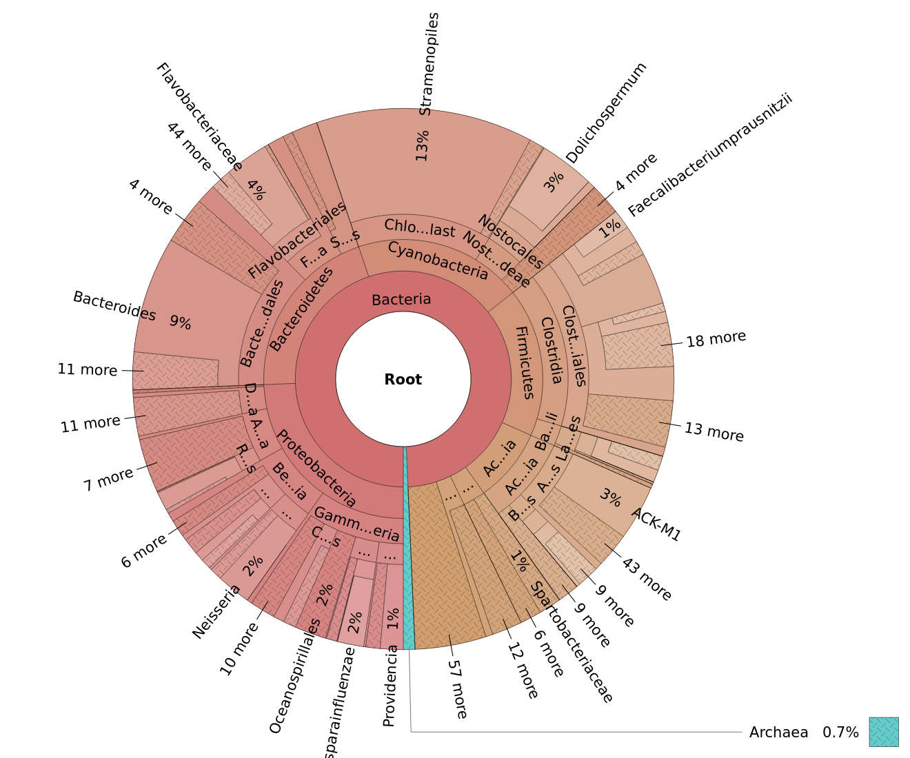

# Krona charts in R

This repo provides an R functions for creating [Krona charts](https://github.com/marbl/Krona/wiki) in R.

## Features

- The interactive charts can be explored directly within R-Markdown documents in RStudio and will be embedded into documents rendered to *HTML* webpages.
- For document formats like PDF, DOCX, ODT, etc., snapshot images will be inserted.
- Support for [phyloseq](https://github.com/joey711/phyloseq) objects.
- Flexible grouping into multiple datasets explored within the same chart
- Custom coloring schemes

## Example

The following snapshot image of a Krona chart gives an overview of the taxa in the GlobalPatterns dataset from [phyloseq](https://joey711.github.io/phyloseq/index.html) package. It was generated in the [example analysis](example.md).

## Tutorial

A small tutorial is provided in the [example R-Markdown document](example.Rmd). Two rendered versions can be downloaded:

- A [*HTML* webpage](example.html) with embedded interactive charts
- A [*PDF* document](example.pdf)

For a documentation of all possible options for `plot_krona` see the [R script](embed_krona.R). 
